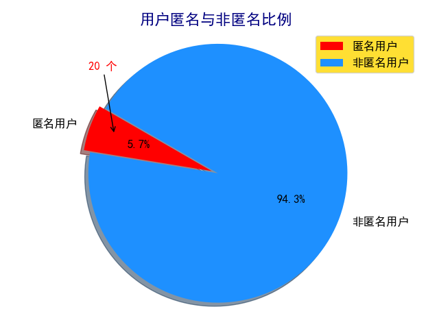

本项目采用scrapy框架，爬取知乎的回答，主要是为了学习scrapy框架，以及了解知乎的反爬机制。
## 1. 爬取知乎回答
### 1.1 爬取知乎回答的思路
知乎的回答是动态加载的，所以不能直接通过requests请求，需要通过selenium模拟浏览器请求，获取到动态加载的数据，然后再通过xpath解析数据，获取到需要的数据。
### 1.2 爬取知乎回答的过程
1. 通过selenium模拟浏览器请求，获取到动态加载的数据
2. 通过xpath解析数据，获取到需要的数据
3. 通过scrapy框架，将数据保存到mysql数据库中
### 1.3 爬取知乎回答的结果
爬取知乎回答的结果如下图所示：

## 2. 数据分析
### 2.1 数据分析的思路
1. 通过pandas将mysql数据库中的数据读取到dataframe中
2. 通过matplotlib将数据可视化
3. 通过wordcloud将数据生成词云
4. 通过jieba分词，获取到词频
5. 加载停用词，过滤掉停用词
6. 通过wordcloud将数据生成词云

### 2.2 数据分析的过程
1. 通过pandas将mysql数据库中的数据读取到dataframe中
2. 通过matplotlib将数据可视化
3. 通过wordcloud将数据生成词云
4. 通过jieba分词，获取到词频
5. 加载停用词，过滤掉停用词
6. 通过wordcloud将数据生成词云

### 项目结构

├── DataAnalysis
│   ├── __init__.py
│   ├── genWordCloud_PersonalInfo.py
│   ├── genWordCloud_Content.py
│   ├── plot.py
│   ├── baidu_stopwords.txt
│   ├── pie.png
│   ├── wordcloud_Content.png
│   ├── wordcloud_PersonalInfo.png
├── sql
│   ├── MySql.sql
├── zhihu
├── spiders
    │   ├── __init__.py
    │   └── zhihuSpider.py
    ├── __init__.py
    ├── dbtools.py
    ├── items.py
    ├── middlewares.py
    ├── pipelines.py
    ├── pipelines2mysql.py
    ├── settings.py
    ├── user-agent.py
├── scrapy.cfg
├── chromedriver.exe
├── requirements.txt
├── readme.md
├── main.py
